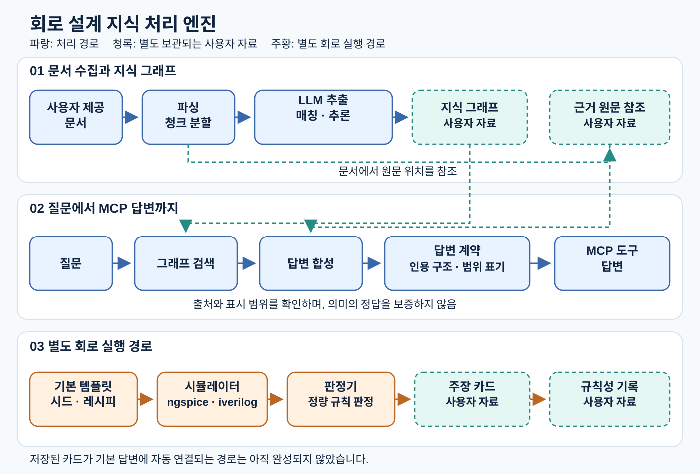

# openclaw-brain — 회로 설계 지식 처리 엔진

사용자가 제공한 문헌을 근거가 연결된 지식 그래프로 만들고, 질문의 근거와 적용 범위를 드러내며, 별도의 회로 시뮬레이션으로 주장을 시험하는 엔진입니다.

## 엔진과 사용자 자료

| 엔진 소스에 포함하는 것 | 별도로 제공·보관하는 사용자 자료 |
|---|---|
| PDF·HTML 파싱, 청크 분할, LLM 추출·매칭·추론, 그래프 저장·검색 코드 | 문헌 원문과 추출된 문장·그림, 축적된 지식 그래프 |
| 답변 합성, 출처·범위 표시 및 답변 계약 검사, MCP 도구 | 실제 질문·답변, 사용자별 평가 자료 |
| 직접 작성한 기본 템플릿·시드·레시피, 공개 PDK 연결 코드, 시뮬레이터 실행·판정 코드 | 실행 후 생성된 netlist·로그·측정 결과, 주장 카드·규칙성 기록과 corpus |

엔진이 자료를 처리하려면 사용자가 자신의 문서, 그래프 저장소, 모델·시뮬레이터 환경을 별도로 제공해야 합니다. 기본 템플릿과 시드는 엔진의 실행 절차를 정의하는 코드이며, 축적된 사용자 자료와 구분합니다.

## 입력에서 답변까지

문서를 입력하면 파싱과 청크 분할을 거쳐 LLM이 개념·관계를 추출합니다. 원문 근거 대조, 기존 개념과의 매칭, 추론을 거친 결과가 지식 그래프에 기록됩니다. 원문 참조는 근거를 찾아볼 수 있게 하지만, 추출 내용의 의미가 항상 옳다는 보증은 아닙니다.

질문은 그래프 검색과 답변 합성을 거칩니다. 답변 계약은 인용 구조와 표시된 적용 범위 등을 점검하고, MCP 도구는 그 결과를 제공합니다. 근거가 부족하면 설정에 따라 표시하거나 답변을 보류하거나 모델 지식임을 밝힙니다. 이 검사는 문장 전체의 의미 정확성을 보증하지 않습니다.

별도 회로 경로에서는 템플릿·레시피로 만든 실험을 ngspice 또는 iverilog에서 실행하고, 판정기가 시험 조건과 결과를 주장 카드에 기록합니다. 일부 교차 PDK 결과는 규칙성으로 묶습니다. 이는 해당 회로·조건의 시뮬레이션 결과이며 실리콘 검증이 아닙니다. 저장된 카드의 판정 결과가 기본 질문 답변에 자동으로 반영되는 경로는 아직 완성되지 않았습니다.

## 확인한 범위

PyMuPDF import를 차단한 상태에서 **단위시험 1,700개 통과·143개 건너뜀**을 확인했습니다. 주 문서 인입 경로는 유지하고 미사용 legacy PDF 경로 두 곳은 제외했습니다. 라이브 모델·Neo4j·시뮬레이션을 실행한 결과는 아닙니다. [구조 설명](ARCHITECTURE.md)과 [제3자 조건](THIRD_PARTY.md)을 함께 확인해 주세요.

## 범위와 이용 조건

이 배포본은 **엔진 소스와 합성 입력을 사용하는 시험**을 제공합니다. 원문·실제 지식 데이터와 개발 저장소의 과거 이력은 포함하지 않습니다. 단위시험과 패키징 확인은 실제 서버·모델·PDK 환경의 배포 검증을 대신하지 않습니다. 별도 허락 없이 허용하는 범위는 소스 열람과 심사입니다. 실행·수정·재배포에는 별도 허락이 필요합니다. 제3자 구성요소의 조건은 각각 따릅니다.

구조를 수정할 때는 [Mermaid 원본](assets/architecture-core.mmd)을 참고할 수 있습니다. [로컬 미리보기](preview.html)는 정적 HTML입니다.
